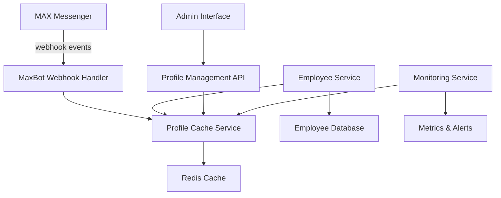
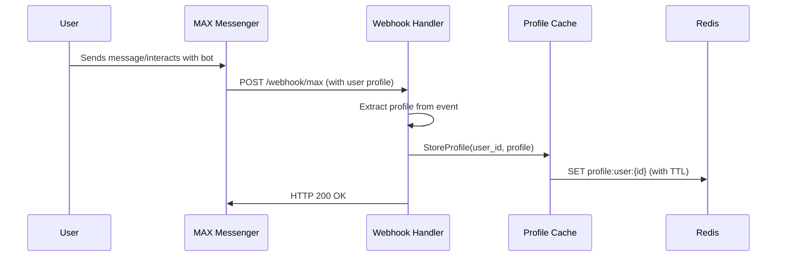
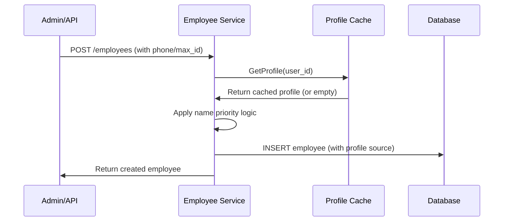
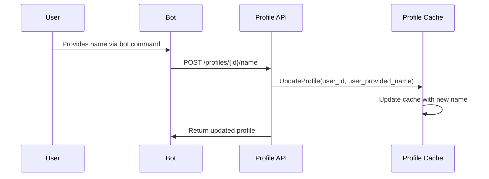

# MAX Webhook Profile Integration Documentation

## Overview

This document describes the new webhook-based approach for collecting user profile information from MAX Messenger. This replaces the previous direct API approach and provides the only officially supported method for obtaining user names and profile data.

## Architecture Overview

The webhook integration system consists of several key components working together to collect, cache, and utilize user profile information:



## Key Components

### 1. Webhook Handler (`maxbot-service`)

**Location**: `maxbot-service/internal/usecase/webhook_handler.go`

The webhook handler processes incoming MAX Messenger events and extracts user profile information:

- **Endpoint**: `POST /webhook/max`
- **Supported Events**: `message_new`, `callback_query`
- **Profile Extraction**: Automatically extracts `user_id`, `first_name`, `last_name` from events
- **Error Handling**: Graceful handling of malformed events and missing data

**Key Features**:
- Idempotent processing (duplicate events are handled safely)
- Automatic profile updates when new information is available
- Comprehensive logging for debugging and monitoring
- Returns HTTP 200 for all valid requests (as required by MAX)

### 2. Profile Cache Service (`maxbot-service`)

**Location**: `maxbot-service/internal/infrastructure/cache/profile_redis.go`

The profile cache service manages user profile data in Redis:

- **Storage**: Redis with configurable TTL (default: 30 days)
- **Data Structure**: JSON-encoded profile objects
- **Key Format**: `profile:user:{user_id}`
- **Fallback**: Graceful degradation when cache is unavailable

**Profile Data Structure**:
```go
type UserProfile struct {
    UserID           string    `json:"user_id"`
    MaxFirstName     string    `json:"max_first_name"`
    MaxLastName      string    `json:"max_last_name"`
    UserProvidedName string    `json:"user_provided_name"`
    LastUpdated      time.Time `json:"last_updated"`
    Source           string    `json:"source"`
}
```

### 3. Employee Service Integration (`employee-service`)

**Location**: `employee-service/internal/usecase/employee_service.go`

The employee service has been enhanced to automatically use cached profile data:

- **Profile Lookup**: Automatic profile retrieval during employee creation
- **Name Priority**: `user_provided_name` > `max_first_name` > `default_name`
- **Fallback Logic**: Continues to work even when profiles are unavailable
- **Source Tracking**: Records the source of name information in the database

### 4. Profile Management API (`maxbot-service`)

**Location**: `maxbot-service/internal/usecase/profile_management_service.go`

REST API for managing user profiles:

- **GET /profiles/{user_id}**: Retrieve user profile
- **PUT /profiles/{user_id}**: Update profile information
- **POST /profiles/{user_id}/name**: Set user-provided name
- **GET /profiles/stats**: Get profile statistics

### 5. Monitoring and Analytics (`maxbot-service`)

**Location**: `maxbot-service/internal/infrastructure/monitoring/`

Comprehensive monitoring of profile data quality:

- **Coverage Metrics**: Track percentage of users with complete profiles
- **Quality Metrics**: Monitor profile completeness and freshness
- **Webhook Statistics**: Track event processing success rates
- **Alerting**: Configurable alerts for quality degradation

## Data Flow

### 1. Profile Collection Flow



### 2. Employee Creation Flow



### 3. Profile Update Flow



## Profile Source Priority

The system implements a hierarchical priority system for name resolution:

1. **User-Provided Name** (`user_provided_name`)
   - Highest priority
   - Set when user explicitly provides their name via bot commands
   - Source: `user_input`

2. **MAX Profile Name** (`max_first_name`, `max_last_name`)
   - Medium priority
   - Extracted from webhook events
   - Source: `webhook`

3. **Default Name** (`"Неизвестно"`)
   - Lowest priority
   - Used when no other information is available
   - Source: `default`

### Name Resolution Logic

```go
func (s *EmployeeService) resolveName(profile *UserProfile, providedName string) (string, string, string) {
    // 1. Use provided name if available
    if providedName != "" {
        return providedName, "", "manual"
    }
    
    // 2. Use user-provided name if available
    if profile != nil && profile.UserProvidedName != "" {
        return profile.UserProvidedName, "", "user_input"
    }
    
    // 3. Use MAX profile names if available
    if profile != nil && profile.MaxFirstName != "" {
        return profile.MaxFirstName, profile.MaxLastName, "webhook"
    }
    
    // 4. Fall back to default
    return "Неизвестно", "Неизвестно", "default"
}
```

## Configuration

### Environment Variables

```bash
# Profile Cache Configuration
REDIS_ADDR=redis:6379
REDIS_PASSWORD=your-redis-password
REDIS_DB=1
PROFILE_TTL=720h  # 30 days

# Webhook Configuration
MAXBOT_HTTP_PORT=8095
WEBHOOK_SECRET=your-webhook-secret

# Monitoring Configuration
MONITORING_ENABLED=true
PROFILE_QUALITY_ALERT_THRESHOLD=0.8
WEBHOOK_ERROR_ALERT_THRESHOLD=0.05

# Employee Service Integration
PROFILE_CACHE_ENABLED=true
PROFILE_CACHE_TIMEOUT=3s
```

### Docker Compose Configuration

```yaml
services:
  maxbot-service:
    environment:
      - REDIS_ADDR=redis:6379
      - REDIS_DB=1
      - PROFILE_TTL=720h
      - WEBHOOK_SECRET=${WEBHOOK_SECRET}
      - MONITORING_ENABLED=true
    depends_on:
      redis:
        condition: service_healthy
    ports:
      - "8095:8095"

  employee-service:
    environment:
      - PROFILE_CACHE_ENABLED=true
      - PROFILE_CACHE_TIMEOUT=3s
      - MAXBOT_GRPC_ADDR=maxbot-service:9095
    depends_on:
      - maxbot-service

  redis:
    image: redis:7-alpine
    command: redis-server --appendonly yes
    volumes:
      - redis_data:/data
    healthcheck:
      test: ["CMD", "redis-cli", "ping"]
      interval: 10s
      timeout: 3s
      retries: 3
```

## API Documentation

### Webhook Endpoint

#### POST /webhook/max

Processes incoming webhook events from MAX Messenger.

**Request Body**:
```json
{
  "type": "message_new",
  "message": {
    "from": {
      "user_id": "12345",
      "first_name": "Иван",
      "last_name": "Петров"
    },
    "text": "Hello"
  }
}
```

**Response**: `200 OK` (always, as required by MAX)

**Profile Extraction**:
- `message_new` events: Extract from `message.from`
- `callback_query` events: Extract from `callback_query.user`

### Profile Management API

#### GET /profiles/{user_id}

Retrieve user profile information.

**Response**:
```json
{
  "user_id": "12345",
  "max_first_name": "Иван",
  "max_last_name": "Петров",
  "user_provided_name": "",
  "display_name": "Иван Петров",
  "source": "webhook",
  "last_updated": "2024-01-15T10:30:00Z",
  "has_full_name": true
}
```

#### PUT /profiles/{user_id}

Update profile information (admin use).

**Request Body**:
```json
{
  "max_first_name": "Иван",
  "max_last_name": "Петров",
  "user_provided_name": "Иван П."
}
```

#### POST /profiles/{user_id}/name

Set user-provided name (typically called by bot commands).

**Request Body**:
```json
{
  "name": "Иван Петрович"
}
```

### Employee API Updates

#### POST /employees

The employee creation endpoint now automatically uses cached profile data.

**Enhanced Behavior**:
- If `first_name`/`last_name` are empty, attempts to retrieve from profile cache
- Records profile source in `profile_source` field
- Falls back gracefully if profile is unavailable

**Response includes profile source**:
```json
{
  "id": 123,
  "first_name": "Иван",
  "last_name": "Петров",
  "max_id": "12345",
  "profile_source": "webhook",
  "profile_last_updated": "2024-01-15T10:30:00Z"
}
```

### Monitoring API

#### GET /monitoring/profiles/coverage

Get profile coverage metrics.

**Response**:
```json
{
  "total_users": 10000,
  "users_with_profiles": 8000,
  "users_with_full_names": 6000,
  "coverage_percentage": 80.0,
  "full_name_percentage": 60.0,
  "profiles_by_source": {
    "webhook": 7000,
    "user_input": 1000,
    "default": 2000
  },
  "last_updated": "2024-01-15T10:30:00Z"
}
```

#### GET /monitoring/webhook/stats

Get webhook processing statistics.

**Response**:
```json
{
  "total_events": 5000,
  "successful_events": 4800,
  "failed_events": 200,
  "events_by_type": {
    "message_new": 4000,
    "callback_query": 1000
  },
  "profiles_extracted": 3000,
  "profiles_stored": 2900,
  "average_processing_time_ms": 150.5,
  "period": {
    "from": "2024-01-15T00:00:00Z",
    "to": "2024-01-16T00:00:00Z"
  }
}
```

## Error Handling

### Webhook Processing Errors

The system handles various error conditions gracefully:

1. **Malformed JSON**: Log error, return 200 OK
2. **Missing User Info**: Process available data, log warning
3. **Cache Unavailable**: Log error, continue without caching
4. **Duplicate Events**: Idempotent processing, update existing data

### Profile Retrieval Errors

1. **Cache Miss**: Return empty profile, don't fail operation
2. **Cache Timeout**: Use default values, log warning
3. **Invalid Cached Data**: Clear cache entry, use defaults

### Employee Creation Errors

1. **Profile Service Unavailable**: Use provided names or defaults
2. **Incomplete Profile Data**: Use best available information
3. **Name Conflicts**: Prioritize user-provided over cached data

## Security Considerations

### Webhook Security

1. **HTTPS Required**: Always use HTTPS for webhook URLs in production
2. **Webhook Secrets**: Optional webhook secret validation
3. **Input Validation**: All webhook data is validated and sanitized
4. **Rate Limiting**: Consider implementing rate limiting for webhook endpoints

### Data Privacy

1. **Phone Number Logging**: Only last 4 digits are logged
2. **Profile Data**: Stored with appropriate TTL and access controls
3. **Error Sanitization**: Error messages are sanitized before returning

### Access Control

1. **Profile API**: Requires appropriate authentication
2. **Admin Endpoints**: Restricted to authorized users
3. **Monitoring**: Read-only access for monitoring systems

## Performance Considerations

### Caching Strategy

1. **TTL Management**: Configurable TTL (default: 30 days)
2. **Memory Usage**: Monitor Redis memory usage and configure limits
3. **Cache Hit Rate**: Monitor and optimize cache performance

### Webhook Processing

1. **Async Processing**: Webhook processing is designed to be fast
2. **Connection Pooling**: Redis connections are pooled and reused
3. **Timeout Configuration**: Reasonable timeouts prevent resource exhaustion

### Database Impact

1. **Profile Source Tracking**: Minimal additional storage overhead
2. **Index Optimization**: Consider indexing on `profile_source` if needed
3. **Migration Impact**: Database schema changes are backward compatible

## Monitoring and Alerting

### Key Metrics

1. **Profile Coverage**: Percentage of users with complete profiles
2. **Webhook Success Rate**: Percentage of successfully processed events
3. **Cache Performance**: Hit rate, latency, error rate
4. **Profile Quality**: Completeness, freshness, source distribution

### Alert Conditions

1. **Profile Quality Degradation**: Alert when coverage drops below threshold
2. **Webhook Processing Errors**: Alert when error rate exceeds threshold
3. **Cache Failures**: Alert on Redis connection issues
4. **Profile Staleness**: Alert when profiles become too old

### Monitoring Endpoints

- `/monitoring/profiles/coverage` - Profile coverage metrics
- `/monitoring/profiles/quality` - Detailed quality report
- `/monitoring/webhook/stats` - Webhook processing statistics
- `/health` - Service health status

## Troubleshooting

### Common Issues

1. **Webhook Not Receiving Events**
   - Verify webhook URL accessibility
   - Check MAX bot configuration
   - Review firewall and network settings

2. **Profile Data Not Being Cached**
   - Check Redis connectivity
   - Verify Redis configuration
   - Review profile cache logs

3. **Employee Creation Not Using Profiles**
   - Verify profile cache integration
   - Check profile retrieval logs
   - Test profile API endpoints

### Debugging Tools

1. **Log Analysis**: Structured JSON logs for easy parsing
2. **Health Checks**: Comprehensive health check endpoints
3. **Metrics Endpoints**: Real-time metrics for debugging
4. **Test Endpoints**: Manual testing capabilities

### Performance Issues

1. **High Webhook Latency**: Check Redis performance and network
2. **Memory Usage**: Monitor Redis memory and configure limits
3. **Database Performance**: Monitor employee creation performance

## Best Practices

### Development

1. **Use Mock Mode**: Enable mock mode for development and testing
2. **Local Testing**: Use ngrok for local webhook testing
3. **Environment Separation**: Separate Redis databases for different environments

### Production

1. **HTTPS Only**: Always use HTTPS for webhook endpoints
2. **Strong Secrets**: Use cryptographically strong webhook secrets
3. **Resource Limits**: Configure appropriate resource limits
4. **Backup Strategy**: Implement Redis backup and recovery procedures

### Monitoring

1. **Regular Health Checks**: Monitor all service endpoints
2. **Alert Tuning**: Adjust alert thresholds based on operational experience
3. **Log Retention**: Configure appropriate log retention policies
4. **Metrics Collection**: Collect and analyze key performance metrics

## Future Enhancements

### Planned Features

1. **Profile Enrichment**: Additional profile data from MAX API
2. **Bulk Operations**: Batch profile updates and retrievals
3. **Profile History**: Track profile changes over time
4. **Advanced Analytics**: More sophisticated profile quality metrics

### Integration Opportunities

1. **External Systems**: Integration with HR systems and directories
2. **Machine Learning**: Profile quality prediction and improvement
3. **Real-time Updates**: WebSocket-based real-time profile updates
4. **Mobile Apps**: Direct profile management from mobile applications

## Support and Resources

### Documentation

- **Webhook Configuration**: `maxbot-service/WEBHOOK_CONFIGURATION.md`
- **Monitoring Setup**: `maxbot-service/MONITORING_ALERTS.md`
- **Deployment Guide**: `PROFILE_INTEGRATION_DEPLOYMENT.md`
- **Migration Guide**: `WEBHOOK_INTEGRATION_MIGRATION_GUIDE.md`

### API Documentation

- **Swagger UI**: `http://localhost:8095/swagger/`
- **gRPC Documentation**: See proto files in `api/proto/`

### Support Channels

- **Service Logs**: Use `make logs` or `docker logs <service-name>`
- **Health Checks**: Monitor `/health` endpoints
- **Metrics**: Access monitoring endpoints for real-time data

For additional support, refer to the service-specific documentation in each service directory.